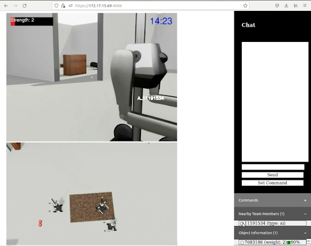

# AI-Collaboration Simulator

This simulator builds upon [ThreeDWorld](https://github.com/threedworld-mit/tdw) (TDW), a platform for interactive multi-modal physical simulation. This simulator as of now allows multiple human users to control the agents present in a single scene in a concurrent manner. It also incorporates an HTTP server to which users can connect to remotely control the agents.

## Setup

Use `git clone --recurse-submodules https://github.com/nesl/AI-Collab.git` to clone the repository with all the submodules.

### TDW Simulator
    
1. Create an environment with python == 3.7.0

2. Run `pip install -r requirements.txt`

3. Change to the **magnebot** directory and run `pip install .`

After this, you will be able to run the simulation by going into the **simulator** directory and using `python simulation.py --local --no_virtual_cameras`. This will display a simulator window with the third person view camera, as well as an opencv window with a first person view of one of the robots. You can control this robot by focusing on the simulator window and using the arrows in the keyboard. Check the file **keysets.csv** for all the keys one can use for each robot.

### Virtual Video Devices

In order to allow us to stream the generated videos to the respective users through WebRTC, we need to create virtual video devices to which we send the generated frames and from which the HTTP server gets the frames as streams.

Follow the steps in [https://github.com/umlaeute/v4l2loopback](https://github.com/umlaeute/v4l2loopback) to build the v4l2loopback module needed to simulate these virtual video interfaces and then just use the next command: `modprobe v4l2loopback devices=4`, where the devices parameter can be changed to create as many virtual devices as you want (here it is 4).

After this you will now be able to run the simulator using the next command: `python simulation.py --local`, which shouldn't present be any different as when using the **--no_virtual_cameras** option.

### Web Interface

Our web interface uses Node.js, as well as WebRTC and Socket.io

Install:

- nodejs 16.17.0
- npm 8.15.0

Change to the **webrtc** directory and issue the next command: `npm install`.
Before running the server, you will need to create a key and a self-signed certificate to enable HTTPS. To do this, just run the next command: `openssl req -nodes -new -x509 -keyout server.key -out server.cert`. It will ask a series of questions, ignore them, only when asking **Common Name** put **localhost** and use your email address when asked for it.

Be sure to change the address in **server.js** before running the server.

The implementation of the WebRTC server was based on [https://github.com/TannerGabriel/WebRTC-Video-Broadcast](https://github.com/TannerGabriel/WebRTC-Video-Broadcast)

For control of the robots by a user, **xdotool** is needed, please install it.

### AI Controller

Change to the **ai_controller** directory and install the gym environment by using the next command `pip install -e gym_collab`

## Operation

1. Run the server using `node server --address "address" --port "port"`. The simulator assumes the virtual devices to be used are the ones starting at /dev/video0, but if you already have some real webcams, you need to specify the parameter `--video-index <number>` and include the index number of your first simulated webcam corresponding to the ones created for the simulator.
2. Run the simulator using `python simulation.py --address "https://address:port"`
3. Using your web browser, go to **https://address:port/broadcast.html**. This will present a view with all the camera views being streamed.

### User Control of a Robot 

1. Using your web browser in the same or a different computer, go to **https://address:port/?client=1**, where the client parameter controls which robot you get assigned. This parameter goes from 1 to the number of user controllable robots you have in the simulation.

### AI Control of a Robot

1. Change to the **ai_controller** directory and run the **server_command** script. You have to also create a new certificate + key as this script executes an HTTPS server to setup the WebRTC parameters. Inside the **server_command**, specify the certificate, key and host address associated with this server, as well as the address to connect to.

#### Note

To make the HTTPS self-signed certificate work:
1. Run **server_command**
2. Access through the web browser to the address provided by the HTTPS server and accept the certificate
3. Try again running **server_command** and it should work!

## AI Controller

The **ai_controller.py** program uses an HTTPS server to negotiate the WebRTC parameters. Socket.IO is used for normal commmunication with the simulator server. The controller uses the same API functions defined in the [Magnebot repository](https://github.com/alters-mit/magnebot/blob/main/doc/manual/magnebot/actions.md). To receive occupancy maps of a certain view radius instead of camera images, you can run the **ai_controller.py** program as `python ai_controller.py --use-occupancy --view-radius <number>`, this way you don't need to make use of the HTTPS server.

### Occupancy Maps

For occupancy maps, the map is divided into cells of the size defined in **simulator/config.yaml**. The parameter *view_radius* specifies how many of these cells will conform the current view around the magnebot being controlled. The next values conform the occupancy map:

* -1: Map boundaries
* 0: No obstacle present
* 1: Ambient obstacle (wall)
* 2: Manipulable object
* 3: Magnebot
* 5: Magnebot being controlled

## Interface

The web interface consists of the camera views assigned to you robot, and a sidebar chat. This chat allows you to communicate with nearby robots, and to get information about your neighbors and scanned objects.

